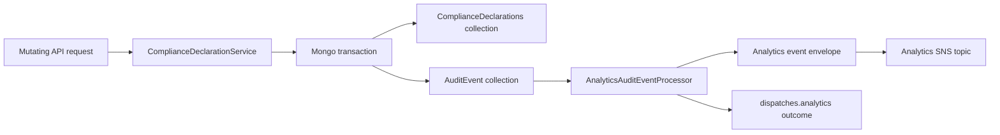
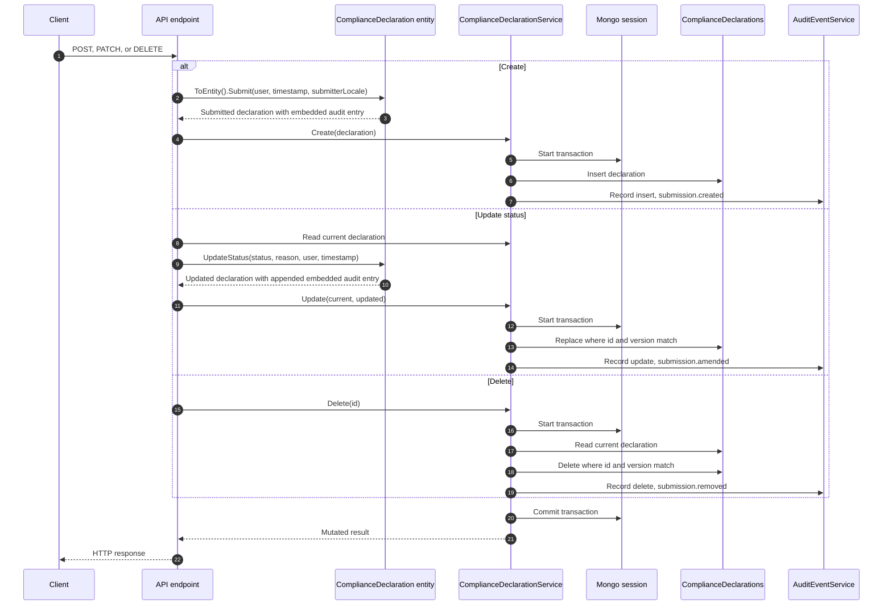
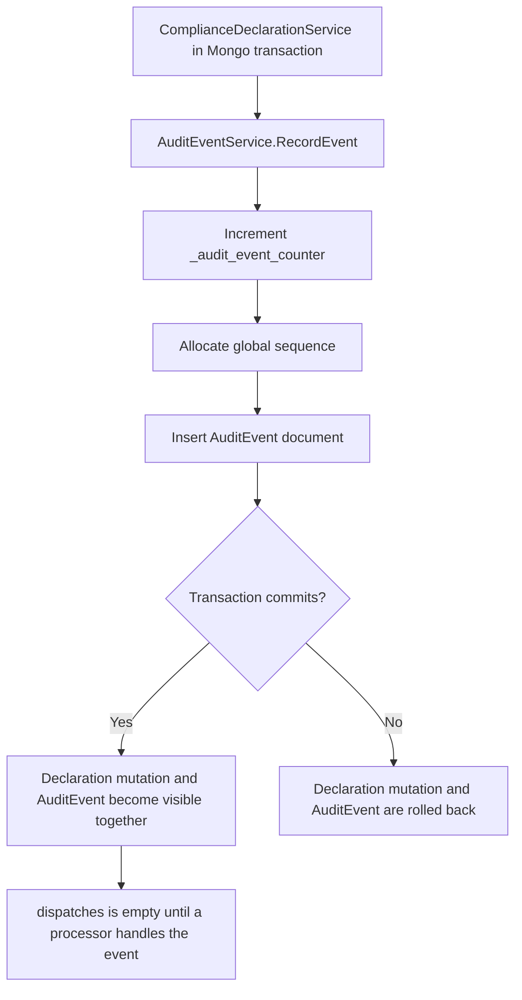
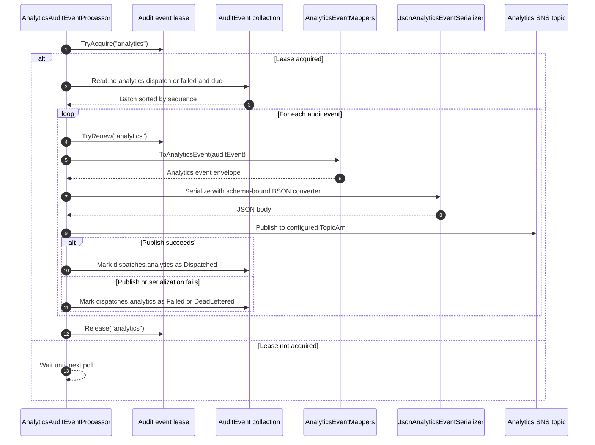

# Compliance declaration end-to-end event flow

This page follows a mutating compliance declaration request from the API write, through audit event recording, to the analytics SNS publish. The final analytics message contract is documented in [Analytics compliance declaration events](analytics-compliance-declaration-events.md).

The service uses two audit concepts:

- The compliance declaration document has an embedded `audit` array. This is the business history of status actions on the declaration.
- The `AuditEvent` collection is an outbox. It records publishable entity changes so a background processor can write analytics events after the API transaction commits.

## Mutating actions

| Action | Endpoint | Declaration change | Audit event operation | Audit event type | Analytics event |
| --- | --- | --- | --- | --- | --- |
| Create | `POST /organisations/{organisationId}/compliance-declarations` | Creates a submitted declaration, assigns version `1`, and adds a `Submitted` entry to the embedded `audit` array. | `insert` | `submission.created` | `insert` with `before: null` and `after` set to the created declaration. |
| Update status | `PATCH /organisations/{organisationId}/compliance-declarations/{complianceDeclarationId}` | Applies a valid status transition, increments the version, updates `updated`, and appends an embedded audit entry. | `update` | `submission.amended` | `update` with the previous declaration in `before` and the updated declaration in `after`. |
| Delete | `DELETE /compliance-declarations/{id}` | Deletes the declaration using the current version as an optimistic concurrency check. | `delete` | `submission.removed` | `delete` with the previous declaration in `before`, `after: null`, and `deletedReason` set. |

Read and search endpoints do not record audit events or analytics events. A PATCH request without a status change returns the existing declaration and does not write a new event.

## End-to-end summary

The declaration mutation and the audit event insert happen in the same Mongo transaction. If either write fails, the transaction is aborted and neither change is committed. Once committed, the analytics processor asynchronously reads undispatched audit events and publishes analytics events to the configured topic.

## Compliance declaration mutation

Create and update build the embedded declaration audit history before the service writes to Mongo. The service then records the publishable audit event in the same transaction as the declaration write.

Update and delete use optimistic concurrency:

- Update replaces the declaration only when the stored `id` and `version` still match the value that was read.
- Delete removes the declaration only when the stored `id` and `version` still match the current value.
- A failed version match raises a concurrency error rather than recording an event for a mutation that did not happen.

Create sends the submitted email after `ComplianceDeclarationService.Create` returns, so email delivery is outside the transaction and outside the analytics write path.

## Audit event outbox

`AuditEventService.RecordEvent` stores the outbox record with these key values:

| Field | Source |
| --- | --- |
| `eventId` | A generated ULID. |
| `sequence` | A global sequence from `_audit_event_counter`, allocated inside the same Mongo transaction. |
| `entity` | `compliance_declaration`. |
| `entityId` | The raw compliance declaration ObjectId string. |
| `operation` | `insert`, `update`, or `delete`. |
| `eventType` | `submission.created`, `submission.amended`, or `submission.removed`. |
| `version` | The entity version after the operation. Delete records `current.Version + 1`. |
| `before` | The previous declaration BSON document, or `null` for create. |
| `after` | The new declaration BSON document, or `null` for delete. |
| `schemaVersion` | The declaration schema version, currently `v1.0`. |
| `traceId` | The propagated trace header value, used for service logging and not included in the analytics envelope. |
| `dispatches` | A per-process outcome map, initially empty. |

The `AuditEvent` collection is indexed by sequence, entity/entity id/version, and the analytics dispatch fields so the dispatcher can read the oldest undispatched or retryable events efficiently.

## Analytics event dispatch

`AnalyticsAuditEventProcessor` is the background writer for analytics events. When enabled, it polls using the configured interval and jitter, acquires a Mongo lease for the process name `analytics`, and reads up to the configured batch size.

The processor reads audit events where `dispatches.analytics` does not exist, or where it is `Failed` and `nextAttemptAt` is due. Each event is mapped to the analytics envelope:

- `eventId`, `sequence`, `entity`, `operation`, `eventType`, timestamps, actor, version, `before`, and `after` are copied from the audit event.
- `entityId` is changed from the raw ObjectId string to `compliance_declaration_{objectId}`.
- `schemaVersion` is changed from `v1.0` to `compliance_declaration.v1.0`.
- `piiKeyRef` is currently set to `null`.

The serializer loads the embedded compliance declaration JSON schema and uses it to write the `before` and `after` BSON documents with the expected field names and JSON value formats.

## Publish outcome

Analytics events are published to the configured SNS topic with `Content-Type` set to `application/json`. If the JSON body is too large for the SNS message size budget, the sender gzip-compresses the JSON, base64-encodes it, and adds `Content-Encoding: gzip+base64`.

After publish:

- Success marks `dispatches.analytics.status` as `Dispatched` and increments `attemptCount`.
- Failure marks the dispatch as `Failed`, stores the exception message, increments `attemptCount`, and sets `nextAttemptAt`.
- When the configured maximum attempt count is reached, the dispatch is marked `DeadLettered` and no further retry time is set.

Delivery is at least once. The processor reads from Mongo and marks an event as dispatched only after SNS publish succeeds, so duplicate analytics messages are possible if a publish succeeds but the dispatch update fails, or if a stale read sees an old dispatch state. Downstream analytics consumers should use `eventId` or `sequence` to make ingestion idempotent.

## Configuration

The runtime controls live under `AnalyticsAuditEventProcessor`:

| Setting | Purpose |
| --- | --- |
| `ProcessingEnabled` | Enables or disables the background analytics writer. |
| `ProcessName` | Dispatch process name, currently `analytics`. |
| `TopicArn` | SNS topic that receives analytics events. |
| `BatchSize` | Maximum audit events processed per poll. |
| `PollIntervalSeconds` and `PollJitterSeconds` | Delay between processor polls. |
| `LeaseDurationSeconds` | Duration of the Mongo dispatch lease. |
| `MaxDispatchAttempts` | Attempts before an event is marked `DeadLettered`. |
| `FailedDispatchRetryDelaySeconds` | Delay before retrying a failed dispatch. |

The service also contains an optional `AnalyticsAuditEventConsumer` that can read analytics messages from SQS when enabled. That consumer is downstream of the SNS write path and is not required for recording audit events or publishing analytics events.
